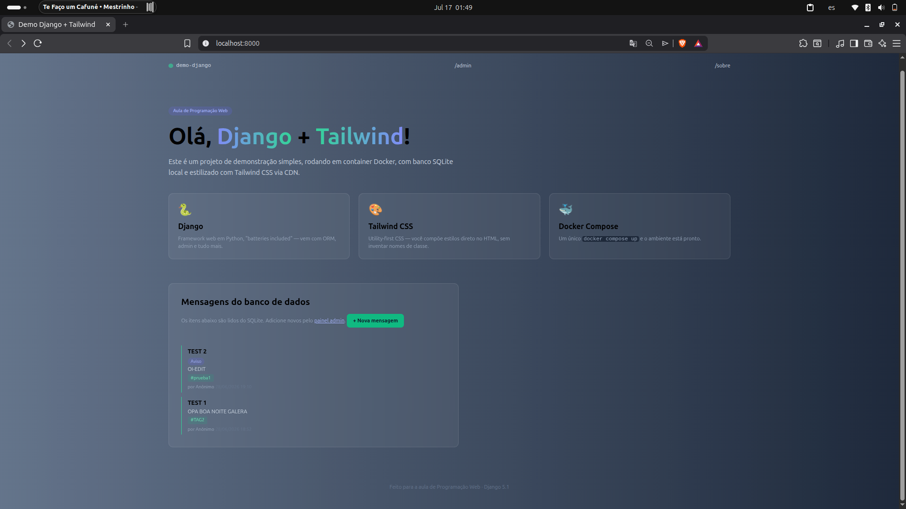
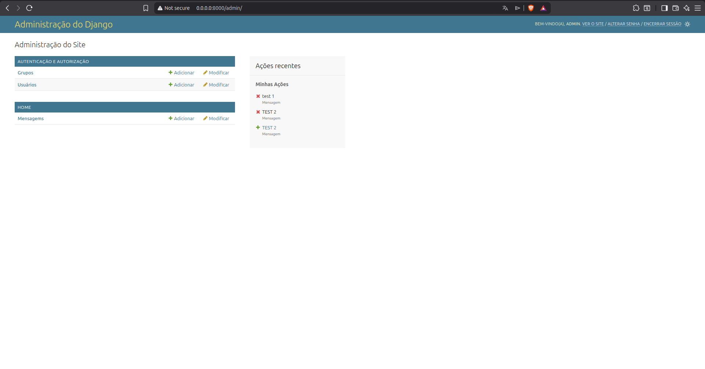
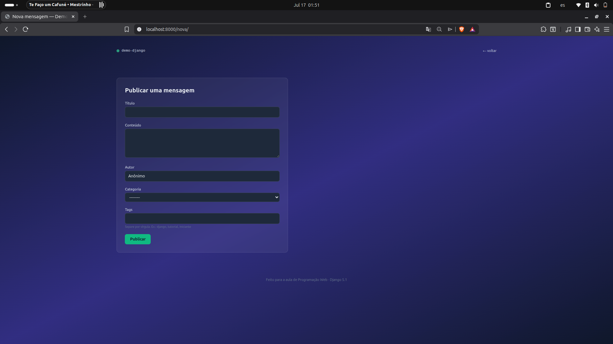
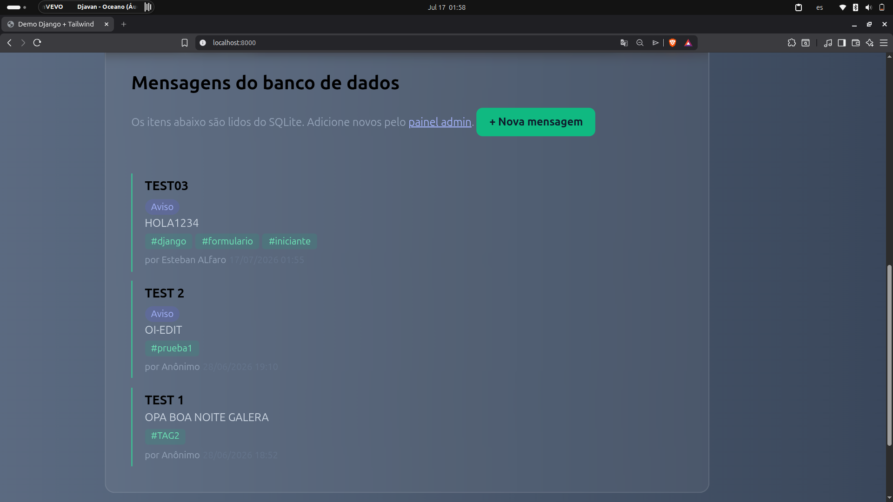
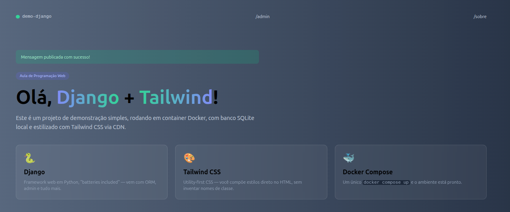
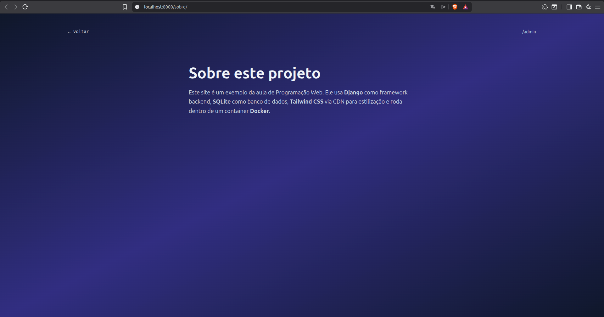

# 🚀 Demo Django + Tailwind


Projeto desenvolvido para a disciplina de **Programação Web**, utilizando **Django**, **Tailwind CSS**, **SQLite** e **Docker**.

## 📌 Sobre

A aplicação apresenta um mural de mensagens desenvolvido com Django. Os dados são armazenados em SQLite e a interface foi construída com Tailwind CSS, executando todo o ambiente através do Docker Compose.

## ✨ Funcionalidades

* 📄 Listagem de mensagens
* 🔐 Painel administrativo (`/admin`)
* 🎨 Interface responsiva com Tailwind CSS
* 🐳 Ambiente configurado com Docker

## 🛠️ Tecnologias

* Python 3.12
* Django 5.1
* Tailwind CSS
* SQLite
* Docker & Docker Compose

## 🚀 Executando o projeto

```bash
git clone <URL_DO_REPOSITORIO>
cd demo-django
docker compose up --build
```

Acesse:

* **Aplicação:** http://localhost:8000
* **Admin:** http://localhost:8000/admin

## 📁 Estrutura

```text
demo-django/
├── core/
├── home/
├── templates/
├── Dockerfile
├── docker-compose.yml
├── requirements.txt
└── manage.py
```

## 📸 Screenshots

### Página Inicial



### Painel Administrativo



### Página Nova



### Página Mensagens




### Retorno Visual 


---
### Página Sobre



---

Desenvolvido por **Esteban Alfaro**.
